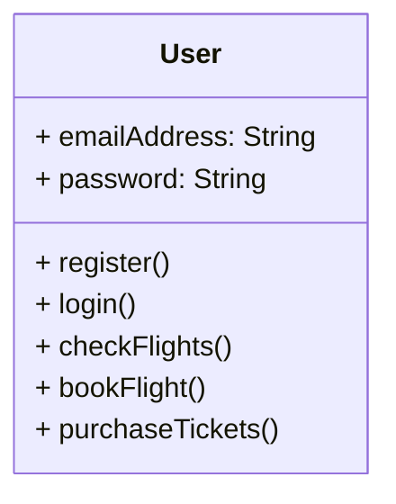
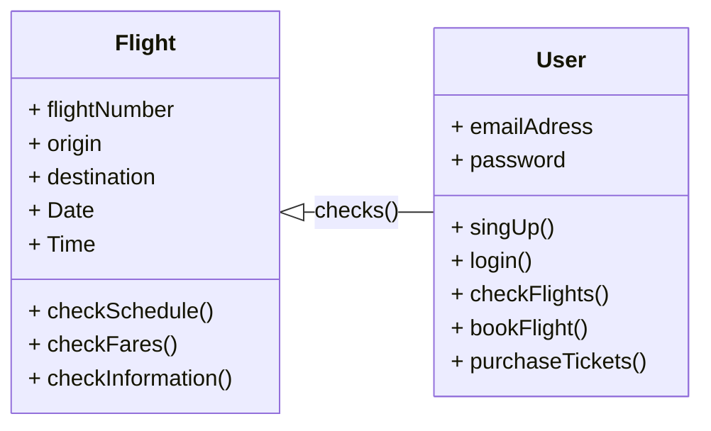
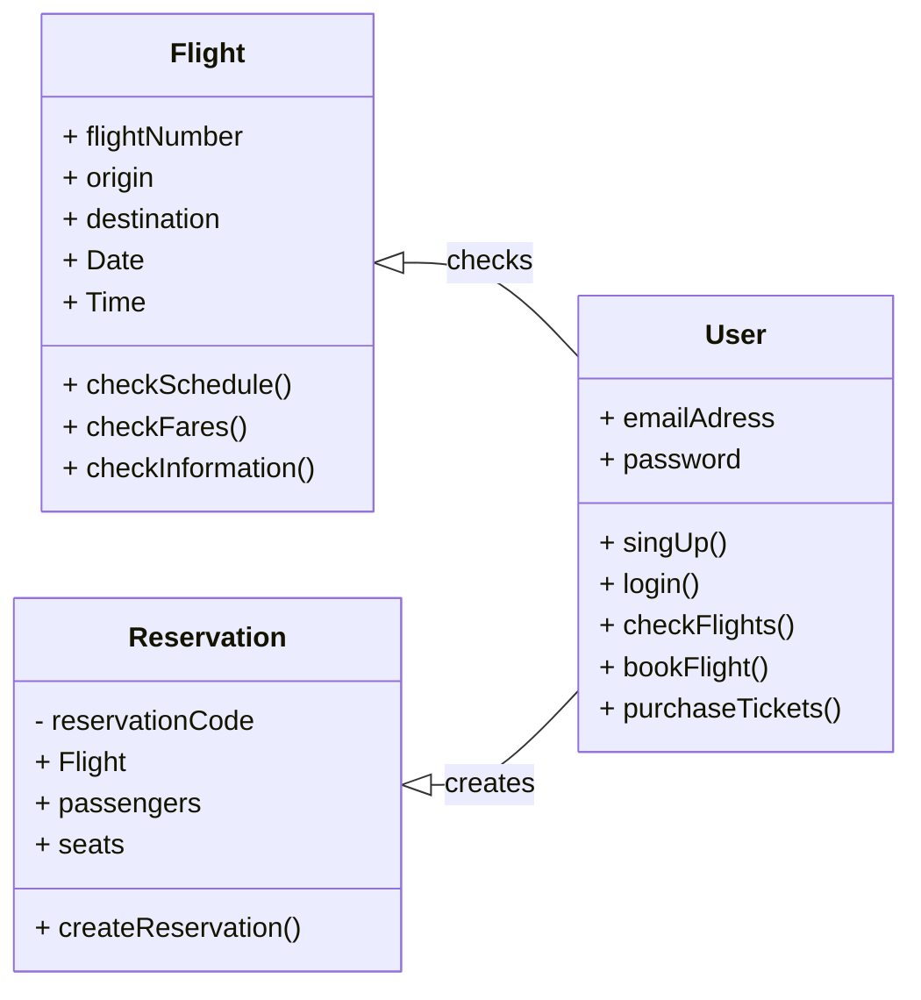
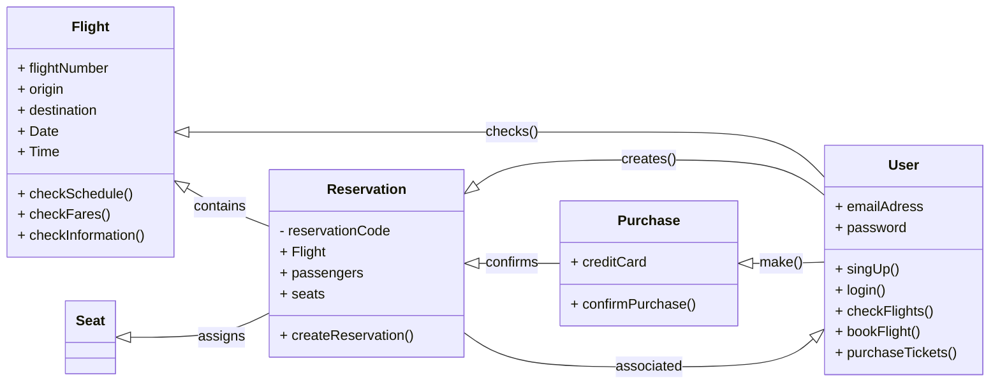

# Challenge_02
## First step
The first thing that i did was to create the "main" class called **User** that represents an user in the flight reservation system. 

**The attributes** of the User class are; **emailAddress**: Stores the user’s email address, and **password**: Stores the user’s password.

**The methods** are **signUp()**: Allows the user to create an account, **login()**: Authenticates the user, **checkFlights**(): Enables the user to search for available flights, **bookFlight**(): Allows the user to reserve a flight and **purchaseTickets**(): Facilitates ticket purchase.
## Second step
Then I create the second class named **Flight** that represents the flight information, here is the relation between the User and Flight class. 

The Attributes of the flight class are flightNumber: Stores the unique flight identifier, origin: Indicates the departure location, destination: Indicates the arrival location, Date: Represents the flight date and Time: Represents the departure time.
The Methods are: checkSchedule(): Provides information about flight schedules, checkFares(): Displays fare details and checkInformation(): Retrieves additional flight information.
## Third step 
When the user have already looked for a flight the next thing that he/she should do it`s to make a reservation. The next class its called Reservation 

The attributes of the Reservation Class are; reservationCode: Unique code for each reservation, Flight: Associated flight for the reservation, passengers: List of passengers included in the reservation and seats: List of assigned seats.
The Methods are:
createReservation(): Creates a new flight reservation.
## Fourth step 
the last thing that i did was to set up the last two classes called, Purchase and Seat, here is the final Flight reservation system UML diagram:

In general, throught this Flight reservation system diagram, Users can search for flights, create reservations, and purchase tickets, thanks to a system that manages flight details, reservations, and payment processing, the relationships between these classes define how an User interacts within the system.

Reservation Class is associated with a User, this implies that a user can make reservations and that each reservation is associated with a specific user, and Reservation class assigns Seat Class, and finally Purchase confirms a reservation. 
